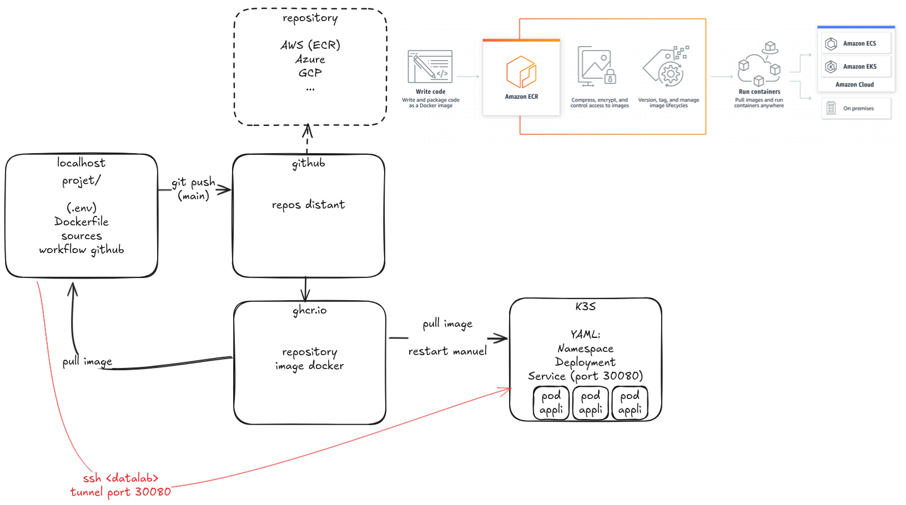
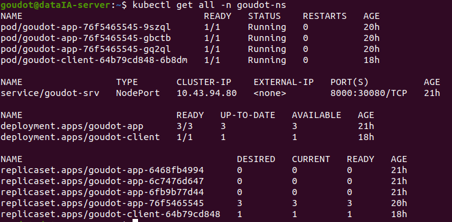
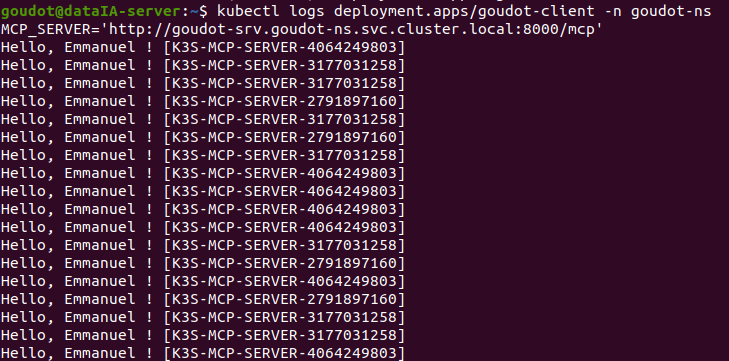

# immo-goudot-MCP

démo MCP immo IA

stack : 
- uv
- fastMCP, dotenv
- K3S

## Quickstart
https://gofastmcp.com/getting-started/quickstart

## Init
> uv init
> uv add fastmcp

> uv run fastmcp version
```text
FastMCP version:                                                                        3.2.0
MCP version:                                                                           1.27.0
Python version:                                                                       3.10.18
Platform:                                      Linux-5.15.0-139-generic-x86_64-with-glibc2.31
FastMCP root path: /home/goudot/develLocal/immo-goudot-MCP/.venv/lib/python3.10/site-packages
```

## Lancement 
Server :
```bash
 uv run fastmcp run main.py:mcp --transport http --port 8000
```
Client : 
```bash
 uv run client.py
```

#  Deploy (local)
> docker build -t immo-mcd .  
> docker run -it --rm --name immo-mcd -p 8000:8000 immo-mcd  
> docker run -it --rm --name immo-mcd-ghcr -e APP_NAME=GHCR-APP -p 8000:8000 ghcr.io/data-ia-2024/immo-goudot-mcp:main  

> docker pull ghcr.io/data-ia-2024/immo-goudot-mcp:main  
> docker run -it --rm --name immo-mcd -p 8880:8000 ghcr.io/data-ia-2024/immo-goudot-mcp:main  

## K3S Datalab
Utilisation de kubernetes https://kubernetes.io/docs/reference/kubectl/  


> sudo kubectl get namespace # liste des namespace  
> sudo kubectl get all -n goudot-ns #   


Secrets:  
Création à partir de fichier  
> kubectl create secret generic goudot-env --namespace=goudot-ns --from-env-file=.env.mcp  
Suppression  
> kubectl delete secret generic goudot-env --namespace=goudot-ns  
Liste des secrets  
> kubectl get secret -n goudot-ns

Création Namespace : goudot-ns.yaml  
Création Deployment (3 instances de ghcr.io/data-ia-2024/immo-goudot-mcp:main) : goudot-app.yaml
Création Service : goudot-service.yaml  

Appliquer les ressources du fichier :
> kubectl apply -f goudot-client.yaml  
Supprimer les ressources du fichier :
> kubectl delete -f goudot-client.yaml  
Restart déploiement : 
> kubectl rollout restart deployment.apps/goudot-client -n goudot-ns  

Logs du client :  
